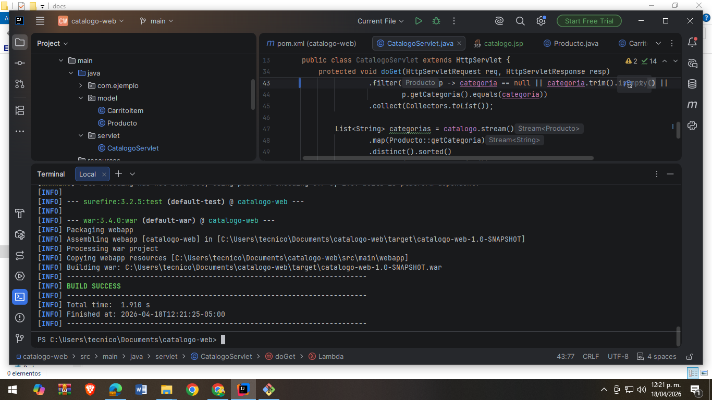
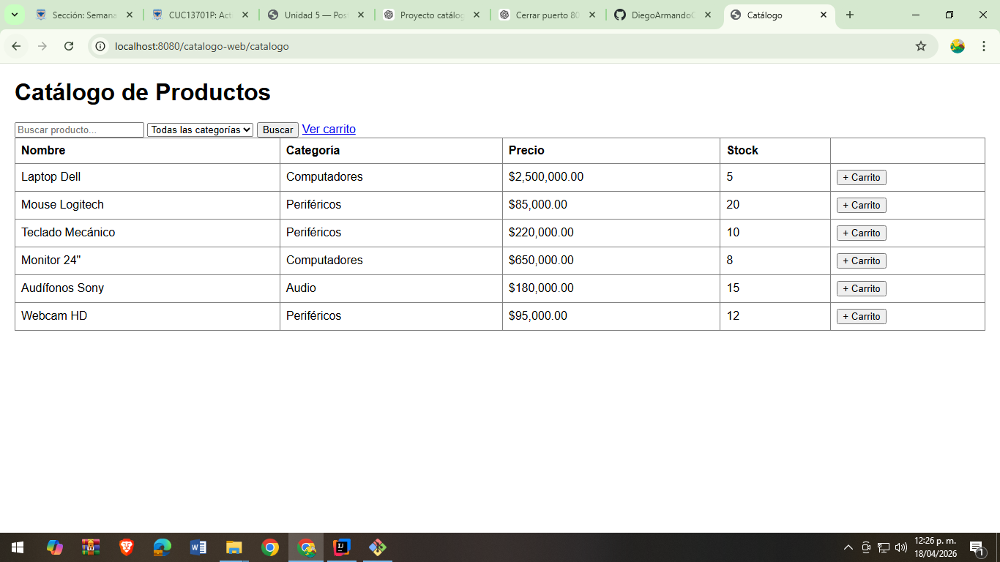
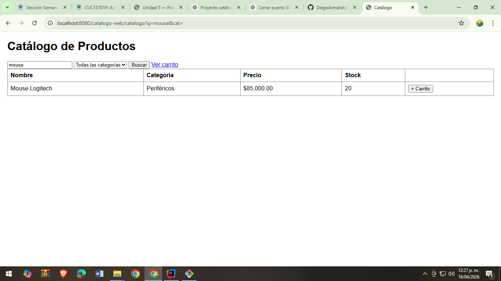
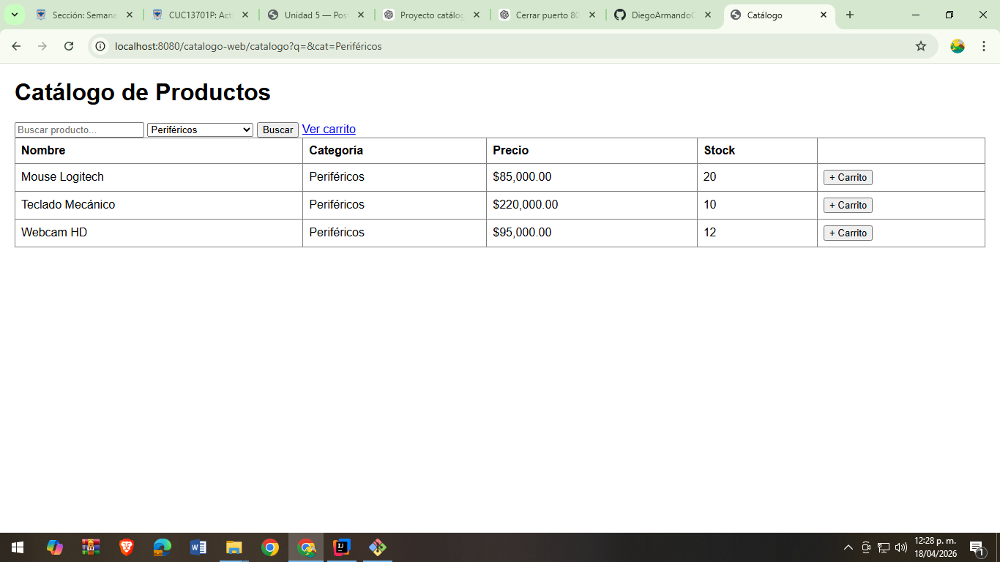
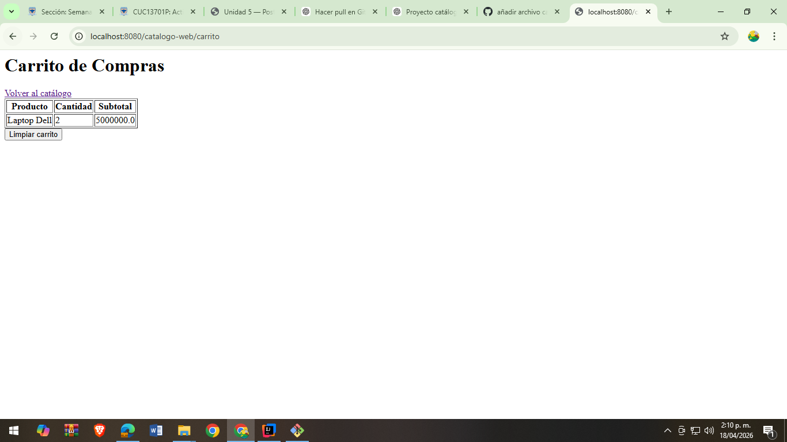
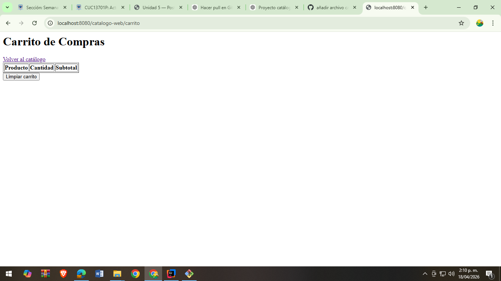

# 📦 Catálogo de Productos con Carrito de Compras

## 📌 Descripción del proyecto
Este proyecto es una aplicación web desarrollada en Java utilizando Servlets y JSP que implementa un catálogo de productos con funcionalidades de búsqueda, filtrado por categorías y un carrito de compras en sesión.

---

## ⚙️ ¿Qué hace la aplicación?

La aplicación permite al usuario:

- Visualizar un catálogo de productos disponibles.
- Buscar productos por nombre.
- Filtrar productos por categoría.
- Agregar productos al carrito de compras.
- Incrementar la cantidad si el producto ya existe en el carrito.
- Visualizar el carrito con subtotales por producto.
- Limpiar el carrito de compras.
- Navegar entre catálogo y carrito de forma dinámica.

---

## 🛠️ ¿Cómo se desarrolló?

El proyecto fue desarrollado con las siguientes tecnologías y arquitectura:

- **Java 17**
- **Jakarta Servlets**
- **JSP (JavaServer Pages)**
- **JSTL y Expression Language (EL)**
- **Apache Tomcat 10**
- **Maven**
- **HTML y CSS básico**

### Arquitectura implementada:
- **Modelo (Model):** Clases `Producto` y `CarritoItem`.
- **Controlador (Servlets):** `CatalogoServlet` y `CarritoServlet`.
- **Vista (JSP):** `catalogo.jsp` y `carrito.jsp`.
- **Gestión de estado:** Uso de `HttpSession` para el carrito de compras.

## 📸 Evidencias del funcionamiento

### ✔️ Proyecto compila sin errores

---

### ✔️ Catálogo con 6 productos + formulario + filtro

---

### ✔️ Búsqueda de productos

---

### ✔️ Filtro por categoría

---

### ✔️ Agregar producto al carrito

---

### ✔️ Agregar el mismo producto (incrementa cantidad)

---

### ✔️ Limpiar carrito

---

### ✔️ Volver al catálogo desde carrito

## 👨‍💻 Autor

**Nombre:** Tu Nombre  
**Proyecto:** Post-Contenido 2 - Programación Web  
**Programa:** Ingeniería de Sistemas  
**Año:** 2026
